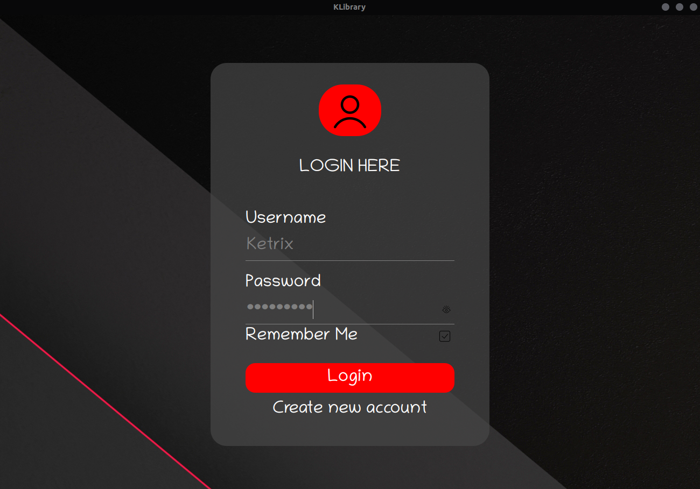
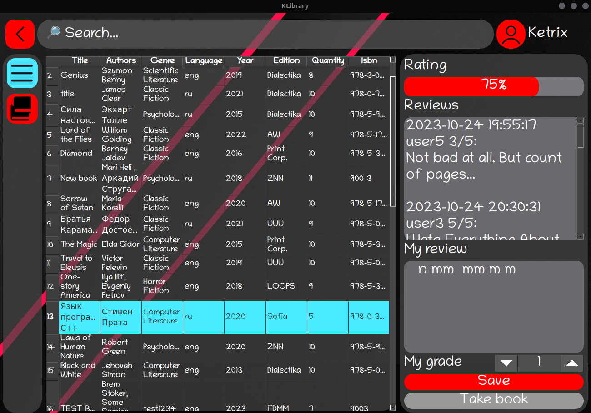

# Introduction
This is an application for abstract library database written on C++/Qt 

pic.1 *Login*

pic.2 *Customer GUI*

pic.3 *Admin GUI*
# Installation
1. Load library_db_backup.sql to your PSQL
2. Change PSQL username, name of your database and 
password in the beggining of constructor of mainwindow.cpp file
3. Run the following command:
```
qmake && make
```
## Requirements
**PSQL** version 16.x (or late)
**QMake** version 3.1 (or late) using **Qt** version 6.x.x and his basic libs
# Use
## As a customer
- Create new account
- Login
- Choose any avaliable books you wish
- Leave some comments
- Leave some ratings
- Check your books orders
## As an admin
- Login with *Admin111* username and same password into account
- Handle customers requests
- Change the almost all contents of database via GUI
# *TODO:*
- *Refactor or rewrite customer code*
- *Fix translaiton bug*
